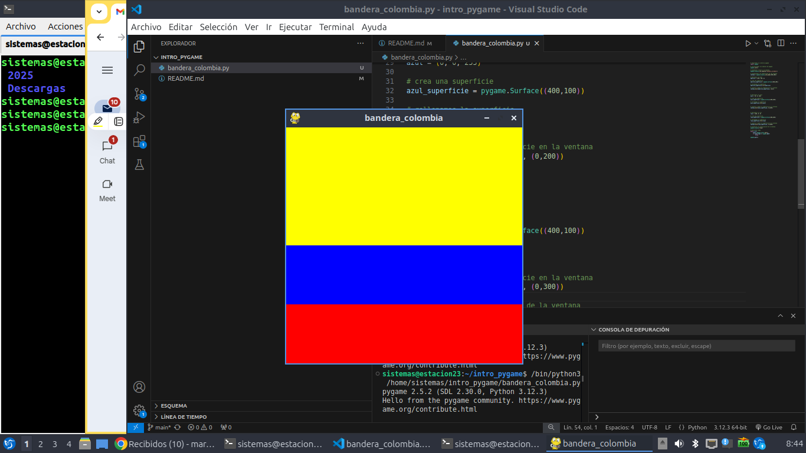

# Estructura de un juego en  Pygame

## Inicialización

- Como en todo programa en Python, se debe importar los módulos o librerias a utilizar
```import pygame```

- Inicializar pygame usando la función init(). Inicializa todos los módulos de pygame importados.
```pygame.init()```

## Visualización de la ventana

```ventana = pygame.display.set_mode((600,400))```

- set.mode() es la función encargada de definir el tamaño de la ventana. En el ejemplo, se està definiendo una ventana de 600 px de ancho, por 400 px de alto.

`pygame.display.set_caption("Mi ventana")`

- set_caption() es la función que añade un título a la ventana.

### Función set_mode

`set_mode(size =(0,0), flags = 0, depth = 0, display = 0)`

- size = (600,400) : define el tamaño de la ventana.

- flags: define uno o más comportamientos para la ventana.
    - Valores:
        - pygame.FULLSCREEN
        - pygame.RESIZABLE
    - Ejemplo:
        - flags = pygame.FULLSCREEN | pygame.RESIZABLE: pantalla completa o dimensiones de la pantalla modificables.

## Bucle del juego - game loop

- Bucle infinito que se interrumpirá al cumplir ciertos criterios.
- Reloj interno del juego
- En cada iteración del bucle del juego podemos mover a un personaje, o tener en cuenta que un objeto a alcanzado a otro o que se ha cruzado la línea de llegada, lo que quiere decir que la partida ha terminado.
- Cada iteración es una oportunidad para actualizar todos los datos relacionados con el estado actual de la partida.
- En cada iteración se realizan las siguientes tareas: 
    1. Comprobar que no se alcanzan las condiciones de parada, en cuyo casi se interrumpe el  bucle.
    2. Actualizar los recursos necesarios para la iteración actual.
    3. Obtener las entradas del sistema, o de interacción con el jugador.
    4. Actualizar todas las entidades que caracterizan el juego.
    5. Refrescar la pantalla.

    ## Superficies pygame
    - Superficie: 
      - Es un elemento geométrico.
      - Linea, polígono, imagen, texto que se muestra en la pantalla.
      - El polígono se puede o no rellenar de color.
      - Las superficies se crean de diferente manera dependiendo del tipo:
           - imagen: image.load()
           - texto: font.render()
           - Superficie genérica: pygame.Surface()
           - Ventana del juego: pygame.display.set_mode()


# Ejemplo bandera de Colombia 


``# Importamos la libreria pygame
import pygame

# inicializamos los modulos de pygame
pygame.init()

# establecer titulo a la ventana
pygame.display.set_caption("bandera_colombia")

# establecemos las dimensiones de laa ventana
ventana = pygame.display.set_mode((400,400))

# definimos un color
amarillo = (255, 255, 0)

# crea una superficie
amarillo_superficie = pygame.Surface((400,200))

# rellenamos la superficie
amarillo_superficie.fill(amarillo)

# inserto o muevo la superficie en la ventana
ventana.blit(amarillo_superficie, (0,0))


# definimos un color
azul = (0, 0, 255)

# crea una superficie
azul_superficie = pygame.Surface((400,100))

# rellenamos la superficie
azul_superficie.fill(azul)


# inserto o muevo la superficie en la ventana
ventana.blit(azul_superficie, (0,200))


# definamos un clor
rojo = (255, 0, 0)

# crea una superficie 
rojo_superficie = pygame.Surface((400,100))

# rellenamos la superficie
rojo_superficie.fill(rojo)

# inserto o muevo la superficie en la ventana
ventana.blit(rojo_superficie, (0,300))

# actualiza la visualizacion de la ventana
pygame.display.flip()

# bucle del juego
while True:
    event =pygame.event.wait()
    if event.type == pygame.QUIT:
        break

pygame,quit()``



## Gestion del tiempo y los eventos 

### Modulo time

- ESte modulo ofrece varias funciones que permiten cronometrar la sesion actual (desde el int()) o pausar la ejecucion , por ejemplo
- Funciones:
   - pygame.time.get_ticks
   - pygame.time.waitpygame.time.delay

- Objeto Clock
   - La funcion tick permite actualizar el reloj asociado con el juego actual.
   - Se llama cada vez que se actualiza la pantalla del juego.
   - Permite especificar el numero maximo de fotogramas que se muestran por segundo, y por tanto, limitar y controlar la velocidad de ejcucion del juego. 
   - Si insertamos en un bucle de juego la sigguiente linea, garantizamos que nunca se ira mas rapido de 50 fotogramas por segundo: `Clock.tick(50)`


 ### Gestion de eventos
- Hay diferentes formas para que el programa sepa que se ha desencaddenado un evento.
- Es esencial que los programas puedan conocer inmediatamente las acciones del jugador a traves del teclado, el mouse, joystick o cualquier otro periferico.


#### Funcion pygame.event.get
- Permite obtener todos los eventos en espera de ser procesados y que estan dizponibkles en una cola.
- Si no hay ninguno, entonces se obtiene una coleccion vacia
```Python 
# Usamos un bucle for para recoget todos los eventos de la coleccion obtenida a llamar a la funcion get.
for event in pygame.event.get()
   if event.type == pygame.KEYDOWN:
     if event.key == pygame.K_ESCAPE:
        PARAR_JUEGO = True
```

#### Funcion pygame.event.wait
- Esta funcion espera a que ocurrab un evento, y en cuanto sucede esta disponible.

``` Python
while True:
    event = pygame.event.wait()
    if event.type == pygame.QUIT:
        break

pygame.quit()

```
#### Funcion pygame.event.poll
- Devuelve 